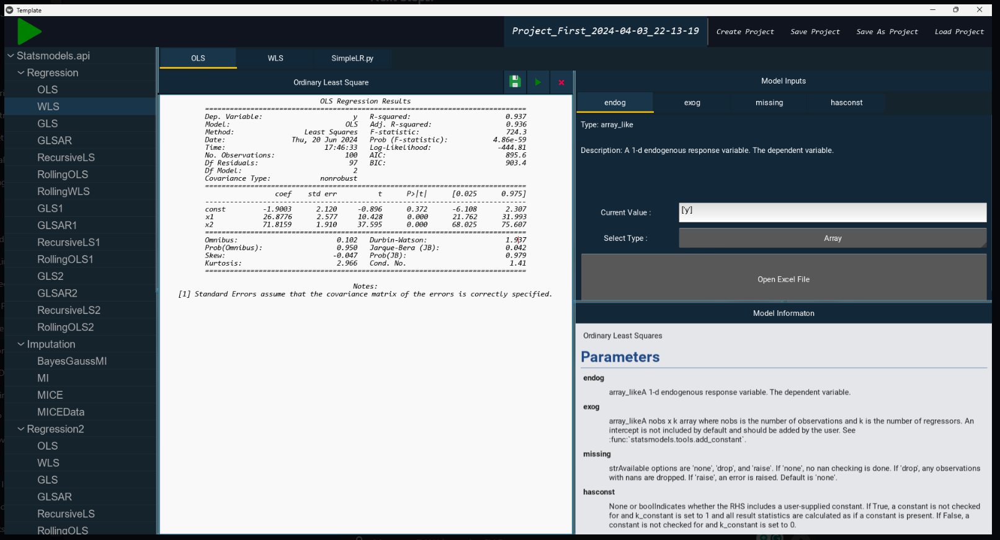

# No-Code-IDE

## Project Overview

This project is designed with the flexibility to incorporate custom models for analytical purposes, focusing on streamlining the process of model runs within a structured environment. By utilizing Python, the project facilitates an efficient workflow from model integration to execution and analysis, ensuring a comprehensive approach to data-driven insights.

## Installation

To set up the project environment and install necessary dependencies, navigate to the project's root directory and run the following command:

bashCopy code

`pip install -r requirements.txt`

This command reads the `requirements.txt` file and installs the listed libraries, preparing the environment for project execution.

Alternatively, users can use the provided `setup.bat` file to install the dependencies. This batch file contains the command to install the required libraries, simplifying the setup process.

## Running the Project

With the environment set up, you can initiate the project by executing the main script from the terminal:

bashCopy code

`python main.py`

This command runs the `main.py` script, which is the entry point of the project, orchestrating the workflow and interactions.

After the first run, user can use the `run.bat` file to execute the project. This batch file contains the command to run the project, simplifying the process for subsequent executions.

## Custom Models Integration

For those looking to extend the project with bespoke analyses, custom models can be incorporated with ease. Models should be Python files placed within the "Analytic" folder and must contain a class named `Model`. The project includes a sample model, `SimpleLR.py`, as a reference. This simple linear regression model demonstrates the expected structure and methods for custom model integration.

### Model Class Requirements:

1.  **Initialization (`__init__`):**

    - Accepts input features (`exog`) as a parameter.
    - Initializes model attributes, including coefficients (`coef_`) and intercept (`intercept_`), to default values or `None`.

2.  **Fitting (`fit`):**

    - Fits the model using provided explanatory (`exog`) and dependent (`y`) variables.
    - Sets model parameters and returns the instance itself for method chaining.

3.  **Summary (`summary`):**

    - Generates a comprehensive summary of the fitted model, including statistics, coefficients, and performance metrics.
    - Returns a summary string.

4.  **Prediction (`predict`):**

    - Accepts new input data (`X_new`) and returns predictions.
    - Returns predictions as an array_like object.

5.  **Documentation:**

    - A detailed docstring at the beginning of the class definition, adhering to statsmodel docstring conventions.

## Project Structure

Upon creation, a project generates a dedicated folder named after the project. This folder includes:

- **MODEL_RUNS**: A directory containing model runs, organized by timestamp.
- **{project_name}\_log.json**: Logs project activities, including model parameters and inputs.
- **{project_name}\_summary.txt**: Provides a readable summary of the project, detailing models used, parameters, and inputs.

## Summary

This README outlines the foundational aspects of the project, from setup and execution to custom model integration and project structure. By adhering to the guidelines and structure provided, users can effectively manage and analyze data within a flexible and robust framework.

---
